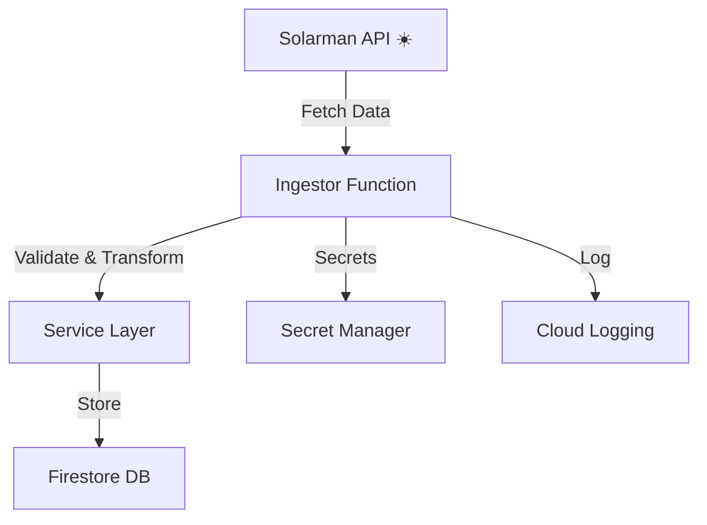

# 🚀 Ingestor Java Function

Welcome to the **Ingestor Java Function**! This service ingests real-time solar data from the Solarman API, securely manages credentials, and stores readings in Firestore for downstream processing and analytics.

---

## 📝 What Does It Do?
- Authenticates with Solarman API using credentials from Secret Manager.
- Fetches current solar readings and device status.
- Transforms and validates the data.
- Stores readings in Firestore (organized by device and timestamp).
- Emits logs to Google Cloud Logging for observability.

---

## 🏗️ Tech Stack
- **Java 21**
- **Spring Boot 3.x**
- **Spring Cloud Function (GCP Adapter)**
- **Google Cloud Firestore**
- **Google Secret Manager**
- **Spring Cloud GCP**
- **OpenFeign** (for API client)
- **Lombok** (for boilerplate reduction)

---

## 🛠️ How It Works



- **Trigger**: HTTP (Cloud Function or Cloud Run endpoint).
- **Configurable**: Uses `application.properties` for environment-specific settings (API endpoints, Firestore collections, etc).

---

## 🚀 Getting Started

### 1. Build
```bash
gradle build
```

### 2. Test
```bash
gradle test
```

### 3. Deploy
- Package as a JAR and deploy to Google Cloud Functions or Cloud Run.
- Set environment variables for GCP project, Firestore, and Secret Manager.

---

## 📂 Key Files & Directories
- `src/main/java/dev/devanks/solarman/ingestor/` - Main source code
- `service/` - Business logic and Firestore access
- `client/` - Solarman API client (OpenFeign)
- `function/` - Cloud Function entry point
- `resources/application.properties` - Configuration

---

## 🧑‍💻 Contributing
Pull requests are welcome! Please ensure code is tested and follows project conventions.

---

## 💬 Contact
For questions, open an issue or contact the maintainer.

